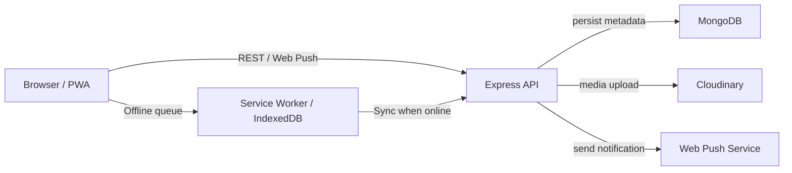

# Suraksha Sathi

A safety reporting and workforce collaboration platform built for mining operations, with offline support, media review workflows, and role-based access control.

## Overview

Suraksha Sathi combines field reporting, user management, and media moderation into a single Node.js + MongoDB application. The backend exposes a modular Express API, while the frontend uses static HTML/JavaScript with offline queueing and push subscription support.

Designed for safety teams, the project supports hazard reporting, worker-generated video content, checklist management, attendance tracking, and notification delivery.

## Features

- Authentication & access control
  - JWT access tokens
  - Refresh token flow
  - Role-based authorization (Admin, Manager, TrainingOfficer, Worker)

- Safety reporting
  - Hazard reports with category and severity tags
  - Hazard media upload (photos, videos, audio)
  - Follow-up actions and escalations

- Media workflows
  - Worker video upload and approval pipeline
  - Safety video and equipment image uploads
  - Cloudinary-backed media storage
  - Content moderation before acceptance

- Productivity modules
  - Checklist templates, items, and item media
  - Task assignments
  - Attendance check-in/check-out
  - Payroll records access

- Offline and notifications
  - IndexedDB request queue for offline submissions
  - Service Worker integration
  - Web Push subscription and notification delivery

## Tech Stack

| Category | Technology |
|---|---|
| Frontend | HTML, JavaScript, Service Worker, IndexedDB, Static assets |
| Backend | Node.js, Express, Mongoose, JWT, bcrypt, multer |
| Database | MongoDB |
| Authentication | JWT access tokens, refresh tokens, cookie + Authorization header support |
| Storage | Cloudinary, local uploaded media staging (images/videos/audio) |
| Automation | Offline queue sync, push notification cleanup endpoints |
| Other | web-push, Cloudinary SDK, content moderation utility |

## Architecture Overview

Suraksha Sathi is built as a static frontend and API-driven backend:

- Frontend pages interact with `/api/v1/*`
- Backend routes are grouped by domain (`user`, `hazard-reports`, `worker-videos`, `push`, etc.)
- MongoDB stores users, reports, media metadata, roles, and notifications
- Cloudinary stores uploaded images/videos while the server handles staging and moderation

## Engineering Highlights

- JWT authentication with refresh token revocation stored in MongoDB
- Role-based access control using a dedicated `Role` model and middleware
- File upload pipeline with multer, media filtering, and Cloudinary upload
- Worker video moderation and approval workflow for safe content publishing
- Offline-first frontend support with request queuing and IndexedDB caching
- Web Push subscription management and admin send/test notification flows
- Modular backend architecture with controllers, routes, models, middlewares, and utilities

## Project Workflow

1. User registers or logs in with email/password
2. Access token is issued and refresh token is stored for session control
3. Workers submit hazard reports, checklist updates, attendance, or media
4. Uploaded files are validated, staged locally, then uploaded to Cloudinary
5. Admin/TrainingOfficer reviews reports, video approvals, and escalations
6. Notifications are sent to subscribed users when relevant events occur
7. Offline submissions queue in the browser and sync when connectivity returns

## Folder Structure

- `backend/src/app.js` — Express application setup
- `backend/src/index.js` — server bootstrap and database connection
- `backend/src/routes/` — domain route definitions
- `backend/src/controllers/` — request handlers and business logic
- `backend/src/models/` — Mongoose schemas and relationships
- `backend/src/middlewares/` — auth, authorization, upload, moderation, error handling
- `backend/src/utils/` — Cloudinary, push, moderation, response wrappers
- `frontend/` — static app shell and feature pages
- `frontend/features_pages/` — frontend views for safety reports, maps, video library, etc.
- `frontend/admin/` — admin user interface pages
- `frontend/training_officers/` — training officer pages
- `frontend/offline-db.js` — IndexedDB offline queue manager
- `frontend/api.client.js` — shared API request logic with offline fallback
- `frontend/push-manager.js` — browser push subscription manager

## Getting Started

1. Open a terminal and install backend dependencies:
   - `cd backend`
   - `npm install`
2. Create a `.env` file with required values:
   - `PORT`, `MONGODB_URI`, `ACCESS_TOKEN_SECRET`, `REFRESH_TOKEN_SECRET`
   - `ACCESS_TOKEN_EXPIRY`, `REFRESH_TOKEN_EXPIRY`
   - `CLOUDINARY_CLOUD_NAME`, `CLOUDINARY_API_KEY`, `CLOUDINARY_API_SECRET`
   - `VAPID_PUBLIC_KEY`, `VAPID_PRIVATE_KEY`
3. Start the backend server:
   - `npm run dev`
4. Open the frontend in a browser or serve `frontend/` from a static server.

## License

TBD
